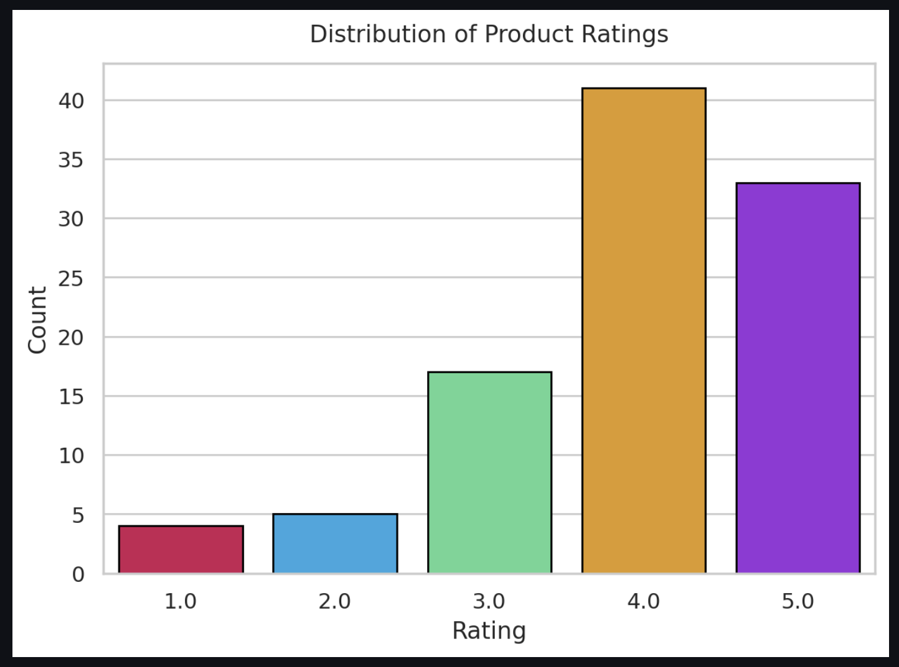
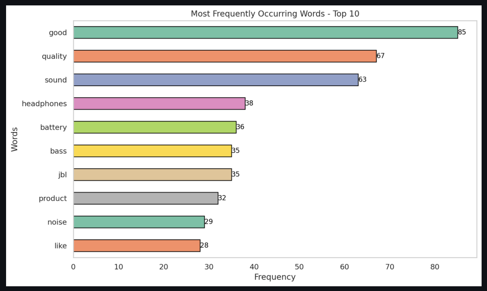
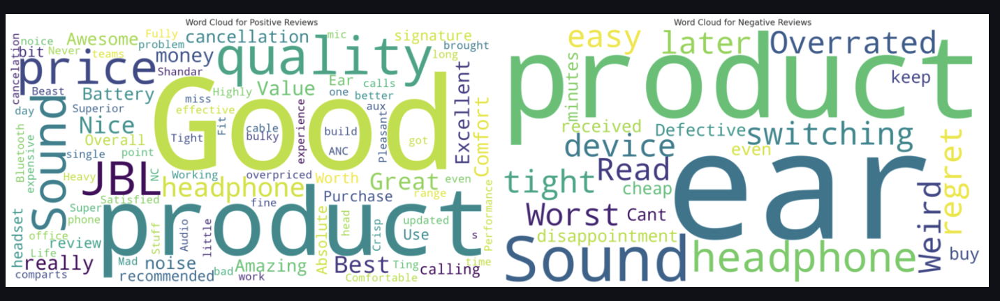
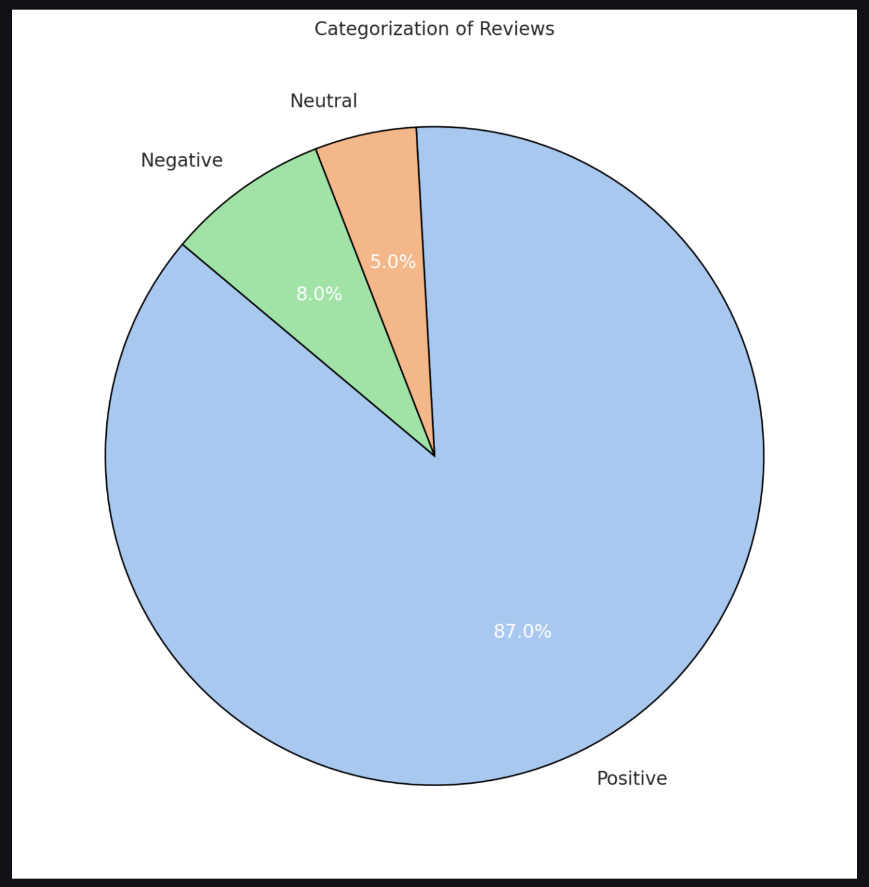
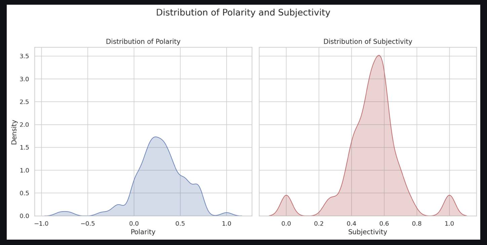
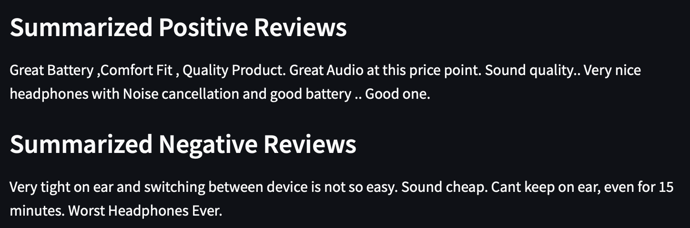

<h1 align="center">Amazon-reviews-analyzer</h1>

  

# Table of Contents
- Basic Overview
- Data Collection and Preprocessing
- Analytical Metrics
- Deployment

# BASIC OVERVIEW :
* Need help determining whether a product is good? Don't worry! The Amazon Review Analyzer is here to help. This tool gathers and analyzes customer reviews from Amazon, providing clear insights into product quality, customer satisfaction, and key trends.
* Given the product URL, the model scrapes product reviews and performs **Exploratory Data Analysis** to provide the following insights: 
  - **Ratings Distribution**
  - **Most Frequent Occurring words (Top 10)**
  - **Word Cloud for positive and negative reviews**
  - **Sentiment Distribution**
  - **Distribution of Polarity and Subjectivity**
  - **Summarized positive and negative reviews**

 # DATA COLLECTION AND PREPROCESSING:
#### DATA COLLECTION
* Once the user provides the URL, the model utilizes Python's **BeautifulSoup** library to extract the Title, Body, and Rating of the reviews for that product. 

#### PREPROCESSING THE TEXT
* Punctuation removal
* Dropping the numbers
* Removing Accented Characters
* Remove Special Characters
  
# Analytical Metrics :

* **Rating Distribution**: It shows how many people rated the product at each level (1 to 5 stars), giving a more nuanced view than the average rating alone.A wide spread of ratings might suggest inconsistent quality or experiences, while a tight cluster around a high rating indicates general satisfaction. 
  

  
  

   
* **Most Frequent Occurring Words**: Frequent words often highlight important features or qualities of the product that matter to users. Potential buyers can quickly understand what aspects of the product are most talked about, helping them make informed decisions. 
  

  
  

   
* **Word Cloud for positive and negative reviews**:  
  - A **Word Cloud** is a visual representation of a collection of words, where the size of each word indicates its frequency or importance within the text or dataset being analyzed.
  - Separate word clouds for positive and negative reviews can clarify whether frequently occurring terms are positive or negative. Positive word clouds can show features customers appreciate, while negative word clouds can highlight common issues.
  

  
  

   
* **Sentiment Analysis**: Sentiment Analysis can help us decipher the mood and emotions of general public and gather insightful information regarding the context. Sentiment Analysis is a process of analyzing data and classifying it based on the need of the research.These sentiments can be used for a better understanding of various events and impact caused by it. By analysing these sentiments, we may find what people like, what they want and what their major concerns are.  
  - **TextBlob** is a python library for Natural Language Processing (NLP), which supports complex analysis and operations on textual data.TextBlob returns polarity and subjectivity of a sentence.
  - **Polarity** refers to the emotional tone of the text, indicating how positive or negative it is. It ranges from -1 (completely negative) to 1 (completely positive), with 0 being neutral.
  - **Subjectivity** measures how much of the text is based on personal opinions versus factual information. It ranges from 0 (completely objective) to 1 (completely subjective). A high subjectivity score means the text is more opinion-based, while a low score means it contains more factual content. 
  

  
  

  

  
  

   
* **Reviews Summary**: We collected the Positive reviews (rating >= 4) and Negative reviews (rating <= 3) and concatonated their titles and passed to the **Facebook's BART-Large-CNN** Model to produce two different summaries.  
  

  
  

# Deployment

Deployed on Streamlit. Check it out! : https://amazon-reviews-analyzer.streamlit.app

# Team:

This project was made by:
* [Kanishk Mehta](https://github.com/kanishkmehta29)
* [Chandrashekhar D](https://github.com/chandrashekhar14d)
